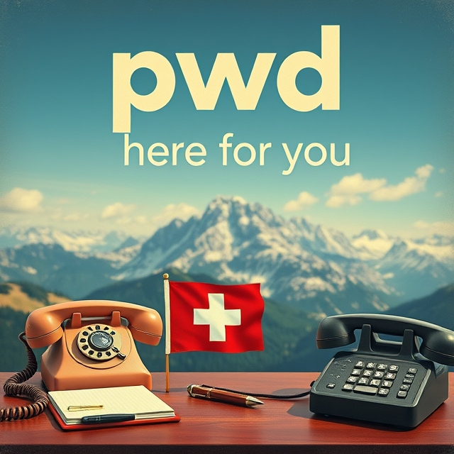

# contact

Free consultation, no strings attached. You can reach us:  

---

-   :material-chat:{ .lg .middle } __By Chat__

    ---
    <!-- Include jQuery -->
    
    
    <!-- Script to load the Zammad chat functionality -- TODO: Add to secrets -->
    

    <!-- Include the chat script -->
    

    <!-- Button to trigger the chat -->
    <button class="open-zammad-chat" style="background-color: #4cae4f;display: block;padding: 0.5em;border: 1px solid #ccc;border-radius: .5em;width: 50%;cursor: pointer;margin-bottom: 1em">Click to Chat</button>
    ....see bottom right corner of the page for chat 

    ---
    

-   :material-email-fast:{ .lg .middle } __By Email__

    ---
    <!-- Include jQuery -->
    

    <!-- Include the feedback form script -->
    

    <!-- Button to trigger the feedback form -->
    <button id="zammad-feedback-form">Feedback</button>

    <!-- Script to load the Zammad form functionality -- TODO: Add to secrets -->
    

-   :fontawesome-brands-discord:{ .lg .middle } __On Discord__

    ---
    <iframe src="https://e.widgetbot.io/channels/1319970966318874664/1319970967019065356" allow="clipboard-write; fullscreen" height="600" width="800" border-radius="0.5em"></iframe>
      ---

