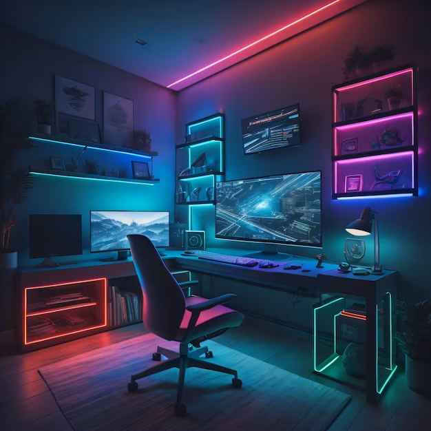
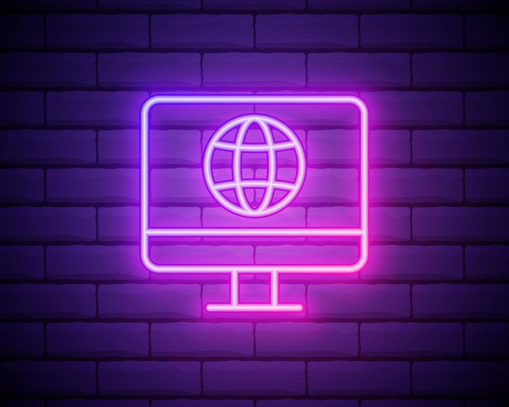
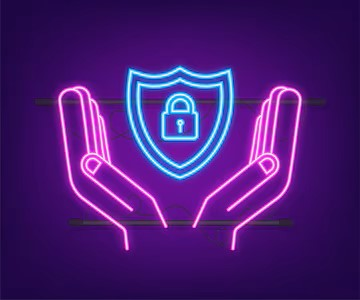

# for your home {: id="top"}

Technology should work for you, not the other way around. We can advise on:

- :fontawesome-solid-computer: __Setup and Configuration__
    
    ---
  
    - PC and Peripheral Build and Setup  
    - Software Installation and Configuration  
    - Network Setup and Configuration  

    [:octicons-arrow-right-24: More ... ](#Initial)

- :material-wifi-cancel: __Device and Network Management__
    
    ---
  
    - Device Synchronization and Integration  
    - Home Automation and Smart Device Setup  
    - Cloud Services Setup 

    [:octicons-arrow-right-24: More ... ](#Device)

- :material-security-network: __Security and Protection__ 

    ---
    
    - Network Security:  
    - Virus and Malware Removal:  
    - Data Backup and Recovery:  

    [:octicons-arrow-right-24: More ... ](#Security)

- :material-help-network: __Troubleshooting and Repair__ 

    ---

    - Network Security  
    - Virus and Malware Removal  
    - Data Backup and Recovery  

    [:octicons-arrow-right-24: More ... ](#Troubleshooting)

- :fontawesome-solid-users-line: __Online Presence__ 

    ---

    - Website Hosting and Maintenance  
    - Home Lab Setup  

    [:octicons-arrow-right-24: More ... ](#Online)

- :material-book-education: __Education and Training__ 

    ---

    - Education and Training  

    [:octicons-arrow-right-24: More ... ](#Education)

## Initial Setup and Configuration {: id="Initial"}

- **PC Build and Setup:** Custom PC assembly and configuration tailored to you needs.
- **Software Installation and Configuration:** Installing and setting up operating systems and essential software.  
- **Network Setup and Configuration:** Setting up home Wi-Fi, routers and other network hardware for optimal performance.  
- **Printer and Peripheral Setup:** Installing and configuring printers, scanners, and other devices.  

[:octicons-arrow-right-24: back to top ... ](#top)

---
## Device and Network Management {: id="Device"}

- **Device Synchronization and Integration:** Ensuring all devices (laptops, smartphones, tablets) work seamlessly together.
- **Home Automation and Smart Device Setup:** Configuring smart home devices like thermostats, cameras, and lights.
- **Cloud Services Setup:** Assisting with setting up and integrating cloud storage solutions for easy file access and sharing.

---
## Security and Protection {: id="Security"}

- **Network Security:** Configuring firewalls, VPNs, and other security measures to protect home networks and data.
- **Virus and Malware Removal:** Identifying and removing malicious software from devices to restore security.
- **Data Backup and Recovery:** Implementing backup solutions and recovering lost or corrupted data.

---
## Troubleshooting and Repair {: id="Troubleshooting"}

- **PC Repair and Troubleshooting:** Diagnosing and fixing hardware and software issues affecting performance.
- **Troubleshooting Internet Connectivity:** Resolving slow or unreliable internet issues, optimizing Wi-Fi performance.

---
## Online Presence {: id="Online"}

- **Website Hosting and Maintenance:** Setting up and managing personal websites or blogs, including ongoing maintenance and security.
- **Home Lab Setup:** Assisting with the setup of personal IT infrastructure, such as servers or NAS, for learning or experimentation.

---
## Education and Training {: id="Education"}

- **IT Education and Training:** Offering personalized guidance and training on using software, managing security, or learning new IT skills.

---