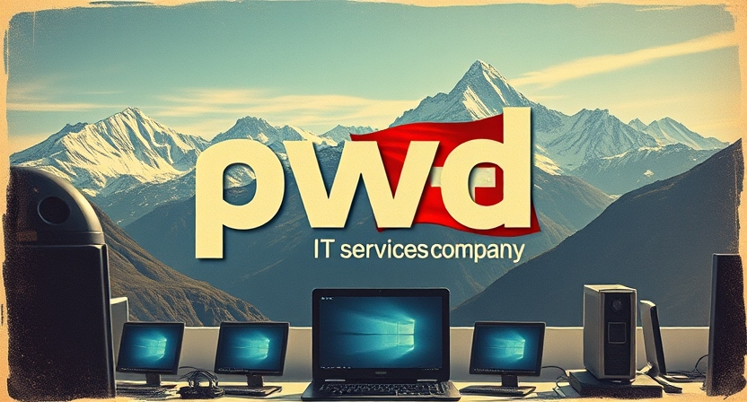

  

Welcome to pwd.dev  – Your Trusted Partner for IT Solutions!

At pwd.dev , we understand that technology should work for you, not the other way around. Based in Switzerland, we specialize in providing personalized IT support for homes and offices. Whether you need help building or repairing your PC, setting up secure networks, hosting and maintaining websites, or even creating a homelab, we've got you covered.

Our mission is to simplify your tech experience. With services ranging from software configuration to IT education, we’re here to ensure your technology runs smoothly and efficiently. <a href="/contact">Reach out</a> to us via chat or email for expert advice and support tailored to your needs.

We’re proud to offer a free consultation for the first hour, so you can explore how we can assist you without any commitment. After that, our transparent hourly rates make it easy to choose the services that fit your requirements.

Let’s make technology work for you. Contact us today and experience the pwd.dev difference!

    <a href="/contact">Contact us for a free consultation...</a>
    <a style="font-size: 1.5em; color:#c0583a; display: inline-block; vertical-align: middle;">:fontawesome-solid-headset:</a>

---

---

---

-   :material-clock-fast:{ .lg .middle } __Get in Contact__

    ---

    Install [`mkdocs-material`](#) with [`pip`](#) and get up
    and running in minutes

    [:octicons-arrow-right-24: Getting started](#)

-   :fontawesome-brands-markdown:{ .lg .middle } __It's just Markdown__

    ---

    Focus on your content and generate a responsive and searchable static site

    [:octicons-arrow-right-24: Reference](#)

-   :material-format-font:{ .lg .middle } __Made to measure__

    ---

    Change the colors, fonts, language, icons, logo and more with a few lines

    [:octicons-arrow-right-24: Customization](#)

-   :material-scale-balance:{ .lg .middle } __Open Source, MIT__

    ---

    Material for MkDocs is licensed under MIT and available on [GitHub]

    [:octicons-arrow-right-24: License](#)

