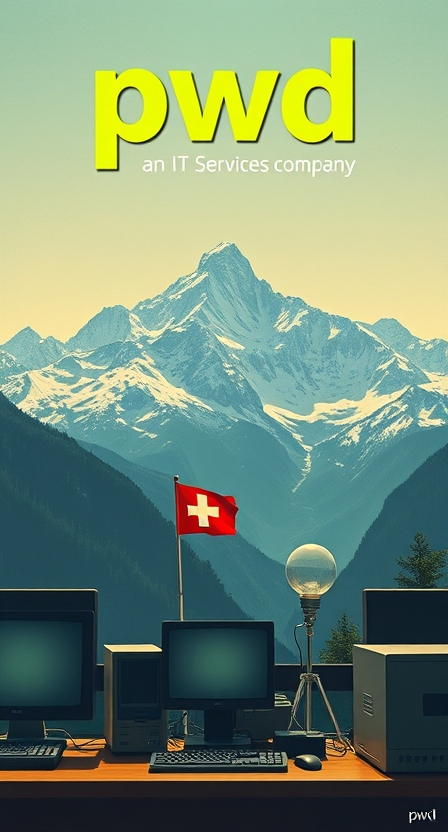

# Home

{ width="250" align=right}

pwd.dev offers a range of IT services for the home and office. We are based in Canton Schwyz, Switzerland.  
From PC build and repair to network support and education, we provide expertise for all your IT needs.  
We also offer website hosting and can help you build your own HomeLab.

---

    <a href="/about"">Contact us for a free consultation...</a>
    <a style="font-size: 1.5em; color:#c0583a; display: inline-block; vertical-align: middle;">:fontawesome-solid-headset:</a>

---

-   :material-clock-fast:{ .lg .middle } __Get in Contact__

    ---

    Install [`mkdocs-material`](#) with [`pip`](#) and get up
    and running in minutes

    [:octicons-arrow-right-24: Getting started](#)

-   :fontawesome-brands-markdown:{ .lg .middle } __It's just Markdown__

    ---

    Focus on your content and generate a responsive and searchable static site

    [:octicons-arrow-right-24: Reference](#)

-   :material-format-font:{ .lg .middle } __Made to measure__

    ---

    Change the colors, fonts, language, icons, logo and more with a few lines

    [:octicons-arrow-right-24: Customization](#)

-   :material-scale-balance:{ .lg .middle } __Open Source, MIT__

    ---

    Material for MkDocs is licensed under MIT and available on [GitHub]

    [:octicons-arrow-right-24: License](#)

